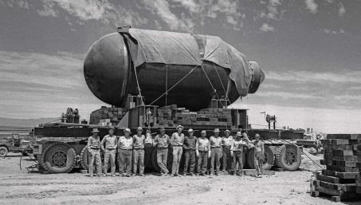
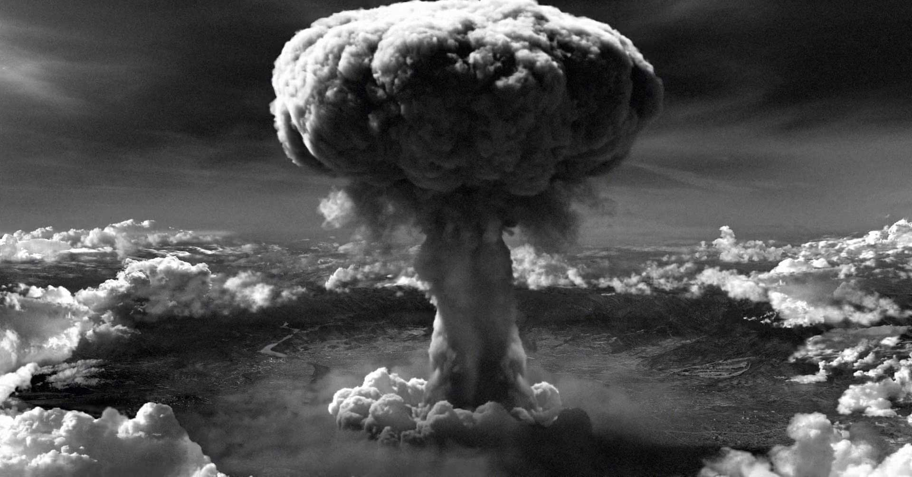

# Les travaux de Robert Oppenheimer

Les travaux de Robert Oppenheimer ont couvert un large éventail de domaines de la physique, allant de la mécanique quantique à la physique nucléaire et à la cosmologie. Oppenheimer est surtout connu pour son travail sur le projet Manhattan, qui a conduit à la création de la première bombe atomique, mais il a également fait des contributions importantes dans d'autres domaines.

Au début de sa carrière, Oppenheimer s'est concentré sur la mécanique quantique et la physique nucléaire. Il a travaillé sur des problèmes liés à la diffusion des neutrons, à la théorie des particules alpha et à la structure des noyaux atomiques. Ses travaux ont jeté les bases de la théorie des réactions nucléaires, qui a été utilisée plus tard dans le développement de la bombe atomique.

Dans les années 1930, Oppenheimer s'est intéressé aux étoiles à neutrons et aux supernovas. Il a développé la théorie des étoiles à neutrons en collaboration avec George Volkoff et a montré que ces objets étaient les restes d'étoiles massives qui avaient explosé en supernova. Cette théorie a ouvert une nouvelle frontière dans la physique théorique et a eu des implications importantes pour la compréhension de l'univers.

Après la guerre, Oppenheimer a poursuivi ses recherches en physique théorique, se concentrant sur des sujets tels que la théorie des particules élémentaires et la cosmologie. Il a également été un défenseur passionné du contrôle des armes nucléaires et de la coopération internationale pour éviter une guerre nucléaire. Ses travaux sur ces sujets ont eu une influence durable sur la politique mondiale et ont contribué à la création d'un mouvement mondial pour le désarmement nucléaire.

Dans l'ensemble, les travaux de Robert Oppenheimer ont eu un impact profond et durable sur la physique et sur la société dans son ensemble. Ses contributions ont couvert un large éventail de domaines de la physique, allant de la mécanique quantique à la cosmologie, et ont eu des implications importantes pour la compréhension de l'univers et pour la sécurité mondiale.

Oppenheimer a également contribué de manière significative à la théorie des champs quantiques, en collaboration avec d'autres physiciens tels que Hans Bethe et Julian Schwinger. Leurs travaux ont jeté les bases de la théorie électrofaible, qui décrit l'interaction électromagnétique et faible entre les particules subatomiques.

En tant que directeur du Centre de physique théorique de l'Université de Californie à Berkeley, Oppenheimer a aidé à créer un environnement stimulant pour la recherche en physique théorique, attirant certains des meilleurs esprits de la discipline. Ses étudiants et collaborateurs sont devenus eux-mêmes des leaders dans leur domaine, contribuant à façonner la physique théorique pour les décennies à venir.

Oppenheimer était également connu pour son style de travail intensif et sa capacité à résoudre des problèmes complexes en utilisant des méthodes innovantes. Il a été salué pour sa capacité à intégrer des idées de disciplines apparemment sans rapport pour créer de nouvelles perspectives sur des problèmes scientifiques.

En dehors de la science, Oppenheimer était également un érudit en littérature, en philosophie et en histoire. Il était passionné par la culture indienne et a travaillé pour promouvoir la compréhension interculturelle entre l'Inde et les États-Unis.

En somme, les travaux de Robert Oppenheimer ont couvert un large éventail de domaines de la physique, de la mécanique quantique à la cosmologie en passant par la physique nucléaire et la théorie des particules élémentaires. Son leadership dans le projet Manhattan a eu un impact profond sur la science et sur la sécurité mondiale, et sa contribution à la création d'un environnement favorable à la recherche en physique théorique a eu des répercussions durables sur la discipline.

## Le projet Manhattan

Pendant la Seconde Guerre mondiale, Oppenheimer a dirigé l'équipe de scientifiques qui a conçu et construit la bombe atomique dans le cadre du projet Manhattan. Son travail sur le projet a été largement axé sur la physique nucléaire, y compris la fission nucléaire et la physique des réacteurs. Il a également supervisé la conception et la construction de l'infrastructure nécessaire pour soutenir les tests d'explosion de la bombe.

Robert Oppenheimer a joué un rôle crucial dans le développement de la bombe atomique dans le cadre du projet Manhattan pendant la Seconde Guerre mondiale. Oppenheimer a été choisi pour diriger le projet en 1942 en raison de ses connaissances approfondies en physique nucléaire et de son talent de gestionnaire.

Le projet Manhattan était une entreprise gigantesque qui a impliqué des milliers de scientifiques, d'ingénieurs et de travailleurs de soutien. Oppenheimer a dirigé l'équipe scientifique qui a développé la bombe atomique, tout en supervisant la construction d'installations de recherche et de production pour soutenir le projet.

L'une des premières tâches d'Oppenheimer a été de sélectionner l'emplacement pour la construction de la première usine de production de plutonium, qui était nécessaire pour créer la bombe. Il a choisi le site de Los Alamos, dans le Nouveau-Mexique, en raison de son éloignement des zones urbaines, de sa topographie montagneuse et de son climat sec et ensoleillé.

Oppenheimer a ensuite supervisé la conception de la bombe elle-même. Il a travaillé en étroite collaboration avec d'autres scientifiques, tels que Enrico Fermi, Hans Bethe et Edward Teller, pour développer les théories nécessaires pour la conception et la construction de la bombe. Oppenheimer était responsable de la coordination des efforts de recherche, de la sélection des meilleurs chercheurs et de la gestion de leurs travaux.

L'équipe dirigée par Oppenheimer a travaillé sur deux types de bombes: l'une basée sur la fission nucléaire de l'uranium, appelée "Little Boy", et l'autre basée sur la fission nucléaire du plutonium, appelée "Fat Man". Les deux types de bombes ont été testés avec succès lors d'explosions de démonstration à Alamogordo, au Nouveau-Mexique, le 16 juillet 1945.

Cependant, Oppenheimer a été confronté à des dilemmes éthiques tout au long du projet Manhattan. Il était conscient du potentiel destructeur de la bombe atomique et a exprimé des préoccupations quant à l'utilisation de l'arme contre des cibles civiles. En 1945, il a écrit une lettre au secrétaire à la Guerre Henry Stimson, avertissant que la bombe atomique pourrait être utilisée pour "tuer des femmes, des enfants et des non-combattants" et a plaidé en faveur d'un contrôle international de l'énergie nucléaire.

Après la guerre, Oppenheimer a été impliqué dans des débats sur la politique nucléaire américaine. En 1947, il est devenu le président de la Commission de l'énergie atomique américaine et a travaillé pour promouvoir le contrôle international des armes nucléaires. Cependant, ses opinions politiques et ses liens passés avec des communistes ont conduit à son déplacement de la direction de la commission en 1953.

En somme, l'implication de Robert Oppenheimer dans le projet Manhattan a été cruciale pour le développement de la bombe atomique. Il a dirigé l'équipe de scientifiques qui a développé la bombe, supervisé la construction d'installations de recherche

