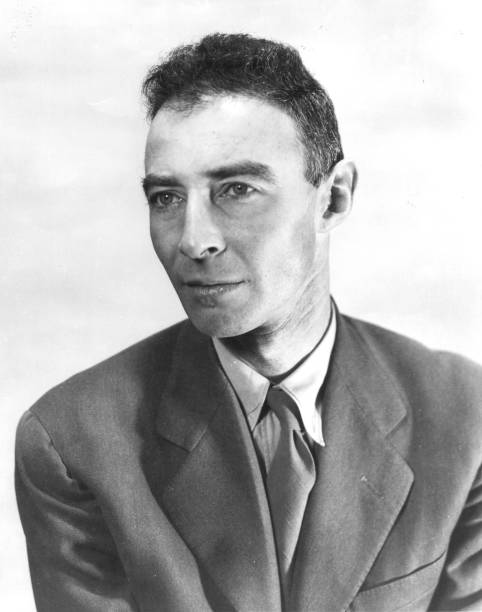

# Robert Oppenheimer

## Accueil

Robert Oppenheimer était un physicien américain de renom qui a laissé une marque indélébile sur l'histoire de la science et de la technologie en tant que directeur scientifique du projet Manhattan, le programme de recherche américain qui a abouti à la création de la première bombe atomique. Oppenheimer a également été un enseignant et un chercheur émérite, un défenseur du contrôle des armes nucléaires, et une figure controversée dans la politique américaine de la guerre froide.

Oppenheimer est né en 1904 à New York, dans une famille aisée d'origine allemande et juive. Son père était un riche importateur de textiles et sa mère était une artiste peintre. Oppenheimer a grandi à Manhattan et a étudié la physique à Harvard, où il a obtenu son diplôme en 1925. Il a ensuite étudié la mécanique quantique à l'Université de Göttingen en Allemagne, où il a obtenu son doctorat en 1927.

Après avoir terminé ses études, Oppenheimer a commencé à enseigner la physique à l'Université de Californie à Berkeley, où il a travaillé sur des problèmes liés à la mécanique quantique et à la physique nucléaire. Dans les années 1930, il a commencé à s'intéresser aux étoiles à neutrons, aux supernovas et à la théorie des étoiles à neutrons, une nouvelle frontière de la physique théorique à l'époque.

Pendant la Seconde Guerre mondiale, Oppenheimer a été recruté par le gouvernement américain pour travailler sur le projet Manhattan. En 1942, il a été nommé directeur scientifique du laboratoire national de Los Alamos, au Nouveau-Mexique, où il a dirigé une équipe de scientifiques pour concevoir et construire la bombe atomique. Oppenheimer a travaillé en étroite collaboration avec des scientifiques tels que Enrico Fermi, Hans Bethe et Richard Feynman pour résoudre les problèmes complexes liés à la création de la bombe atomique.

Le 16 juillet 1945, l'équipe d'Oppenheimer a mené le premier essai nucléaire de l'histoire à Alamogordo, au Nouveau-Mexique, où ils ont déclenché une explosion atomique contrôlée. Cela a mené à la première utilisation de la bombe atomique dans la guerre, lorsque les États-Unis ont largué deux bombes atomiques sur le Japon en août 1945, mettant ainsi fin à la guerre.

Après la guerre, Oppenheimer a continué à travailler pour le gouvernement américain, mais il est devenu de plus en plus préoccupé par les conséquences de l'utilisation de l'arme atomique. Il a commencé à plaider pour le contrôle des armes nucléaires et la coopération internationale pour empêcher une guerre nucléaire. En 1947, il a prononcé un discours célèbre dans lequel il a déclaré que les armes nucléaires rendaient la guerre "inconcevable".

Oppenheimer est devenu une figure controversée dans la politique américaine de la guerre froide en raison de ses positions critiques envers les politiques nucléaires américaines. En 1954, il a été accusé de sympathies communistes par le comité des activités anti-américaines de la Chambre des représentants et a été suspendu de sa sécurité nationale. Bien qu'il ait finalement été réhabilité en 1963, cette expérience a laissé des cicatrices sur sa réputation et sur sa santé mentale.

Malgré cela, Oppenheimer a continué à travailler en tant que professeur de physique à l'Université de Princeton et a poursuivi ses recherches en physique théorique jusqu'à sa retraite en 1966. Il a également été un membre éminent de la communauté scientifique, servant comme président de l'Association américaine pour l'avancement des sciences et de l'Union américaine de physique.

Oppenheimer est décédé en 1967 des suites d'un cancer de la gorge. Sa vie et son travail ont été largement célébrés dans les années qui ont suivi sa mort, et il est souvent considéré comme l'un des scientifiques les plus importants du XXe siècle. Son rôle dans le projet Manhattan et son plaidoyer pour le contrôle des armes nucléaires ont marqué un tournant dans la compréhension de l'impact potentiel de la technologie nucléaire sur la société et ont contribué à la création d'un mouvement mondial pour le désarmement nucléaire.

